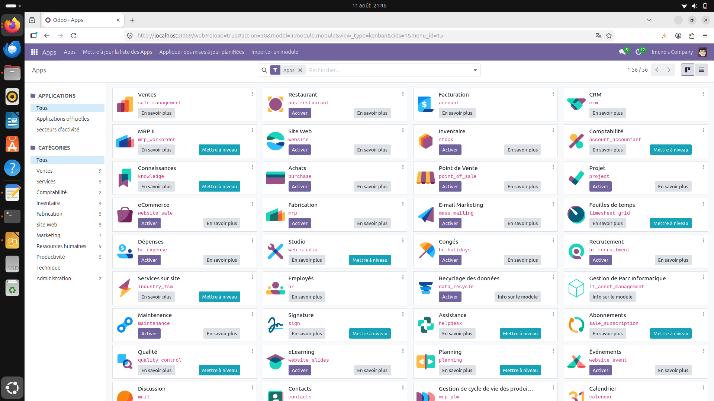
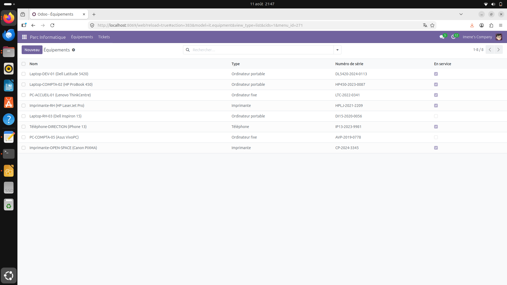
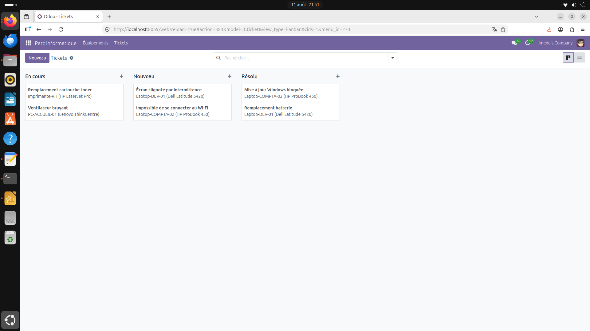
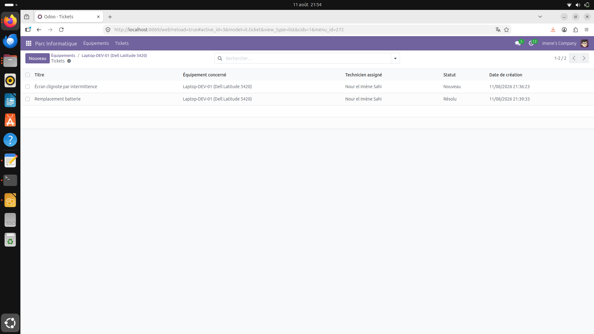
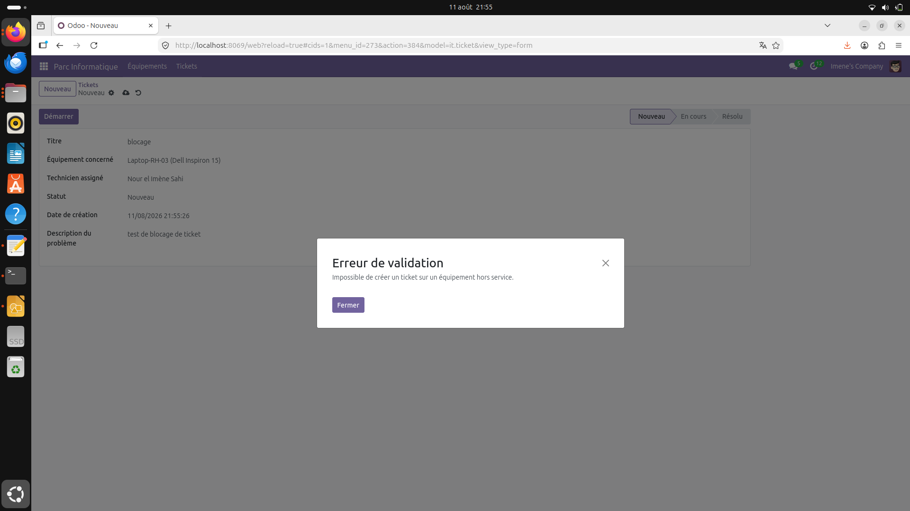
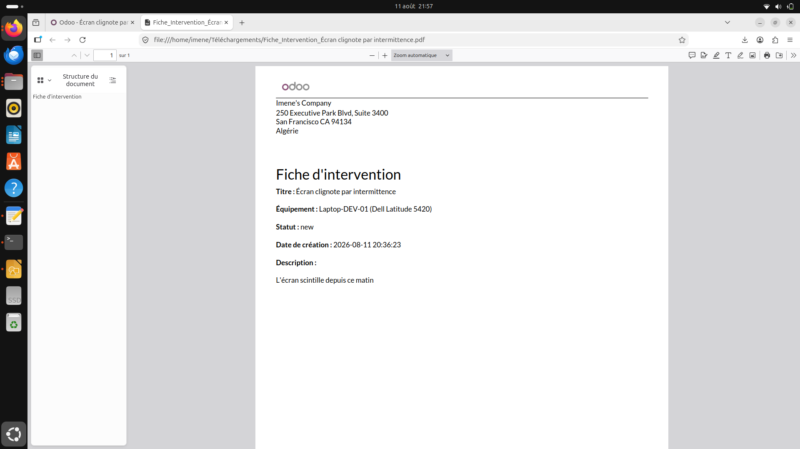

#  Gestion de Parc Informatique — Module Odoo 17

Module Odoo développé pour la gestion d'un parc informatique en entreprise : suivi des équipements, tickets d'intervention technique, et workflow de résolution.

##  Fonctionnalités

- **Gestion des équipements** : ordinateurs, imprimantes, téléphones, avec numéro de série, date d'achat et statut (en service / hors service)
- **Tickets d'intervention** liés à un équipement, avec workflow *Nouveau → En cours → Résolu*
- **Contrainte métier** : impossible de créer un ticket sur un équipement hors service
- **Tableau de bord Kanban** des tickets, regroupés par statut
- **Fiche PDF imprimable** pour chaque intervention (rapport QWeb)
- **Sécurité par rôle** : groupes *Technicien* et *Responsable Parc IT*, avec règle d'accès restreignant chaque technicien à ses propres tickets assignés
- **Assignation à un employé** via intégration avec le module RH natif d'Odoo

##  Stack technique

- Odoo 17.0 (Python 3, PostgreSQL)
- ORM Odoo : modèles, relations Many2one/One2many, champs calculés (`@api.depends`)
- Vues XML (formulaire, liste, kanban)
- Rapports QWeb (PDF)
- Sécurité : `ir.model.access.csv`, `ir.rule`, groupes personnalisés

##  Aperçu









## Installation

1. Cloner ce dépôt dans le dossier `addons` de votre instance Odoo 17 :
```bash
   git clone https://github.com/ImeneeSh/it-asset-management-odoo.git
```
2. Mettre à jour la liste des applications dans Odoo
3. Activer le module "Gestion de Parc Informatique"

##  Structure du projet

```bash
it_asset_management/
├── models/ # Logique métier (équipements, tickets)
├── views/ # Interfaces utilisateur (formulaires, listes, kanban)
├── security/ # Groupes, droits d'accès, règles
└── reports/ # Rapport PDF d'intervention
└── docs/screenshots/ # Captures d'écrans des interfaces
```

##  Auteur

Nour El Imène Sahi
